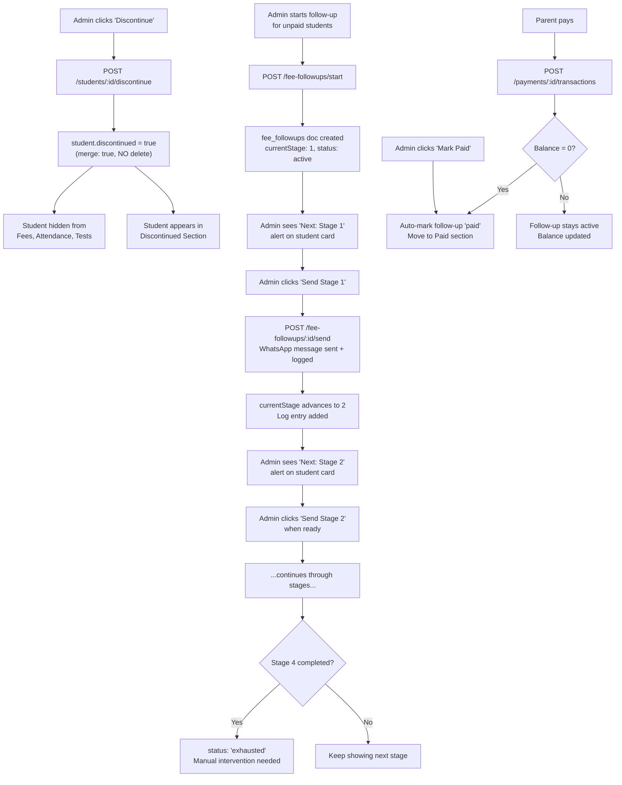

# Discontinued Students & Fee Follow-Up System

Add a "Discontinued" student status with a dedicated section, automatic fee-section hiding, and a **manually triggered** WhatsApp/call/meeting follow-up pipeline with full message logs and a separate "Paid" section — all **without deleting or modifying any existing data**.

## Data Safety Guarantee

> [!IMPORTANT]
> **Zero data deletion.** Discontinuing a student only adds a `discontinued: true` flag and a `discontinuedAt` timestamp to the existing Firestore `students/{id}` doc via `merge: true`. No documents are deleted. No payment records are removed. The operation is fully reversible (re-activate sets `discontinued: false`).

---

## User Review Required

> [!IMPORTANT]
> **WhatsApp Template**: You'll need a new Meta-approved template (e.g. `fee_followup_reminder`) for the scheduled follow-ups. The existing `fee_reminder` template can be reused if you prefer — confirm which template name to use.

> [!TIP]
> **Manual Approach**: No cron jobs, no automated sends. The admin manually decides when to send each follow-up stage. WhatsApp messages (Stage 1 & 2) are sent on button click. Phone calls (Stage 3) and face-to-face meetings (Stage 4) are logged manually. This gives you full control over timing and messaging.

---

## Resolved Questions

1. ✅ **Discontinued student data**: All details (attendance, test marks, payment history) are shown in the Discontinued section. The student is fully hidden from active views (Students, Fees, Attendance, Tests).

2. ✅ **Re-activation**: On reactivation, the student returns to all active views (Students, Fees, Attendance, Tests) with all their historical data intact. Nothing is lost.

3. ✅ **Suggested next date**: The UI will show a **suggested next date** for each follow-up stage based on the escalation intervals (Stage 1 → +3 days → Stage 2 → +4 days → Stage 3 → +5 days → Stage 4). Admin still decides when to actually send — the date is a suggestion only.

4. ✅ **Admin-only access**: Only the admin can discontinue/reactivate students and manage follow-ups. No other role has access.

---

## Proposed Changes

### Component 1 — Student Data Model (Firestore `students/{id}`)

#### [MODIFY] [server.js](file:///c:/Users/Lenovo/projects/TUTION/server/server.js)

Add a new endpoint to mark a student as discontinued (soft flag, no deletion):

**New route: `POST /api/admin/students/:studentId/discontinue`**
- Sets `discontinued: true`, `discontinuedAt: Date.now()`, `discontinueReason: <optional text>` on the student doc via `{ merge: true }`.
- Writes an audit log entry: `student.discontinued`.

**New route: `POST /api/admin/students/:studentId/reactivate`**
- Sets `discontinued: false`, `reactivatedAt: Date.now()` via `{ merge: true }`.
- Writes audit log: `student.reactivated`.

**Modify: `GET /api/admin/students`**
- Add a query parameter `?includeDiscontinued=true` (default `false`).
- When `false`, filters out students where `discontinued === true` from the response.
- This automatically hides them from attendance, tests, and fee list since all those views call `getStudents()`.

**Modify: `GET /api/admin/payments`**
- Filter out payment docs belonging to discontinued students (unless `?includeDiscontinued=true` is sent).

**New route: `GET /api/admin/students/discontinued`**
- Returns only students where `discontinued === true` in the active batch.
- Includes **all student data**:
  - Payment summary (totalFee, transactions, paid, balance)
  - Attendance records (dates attended, percentage)
  - Test marks (all test scores)
  - Discontinued date and reason
- This powers the full-detail Discontinued section.

---

### Component 2 — Discontinued Students UI Section

#### [MODIFY] [admin/index.html](file:///c:/Users/Lenovo/projects/TUTION/admin/index.html)

Add a new nav tab "Discontinued" (between Fees and WhatsApp Conversations in the bottom nav) and a new `<section id="discontinued-view">` containing:

- **Summary cards**: Total discontinued, total outstanding balance from discontinued students
- **Student list**: Each card shows student name, phone, discontinued date, and reason
- **Full detail view per student** (expandable or detail panel):
  - **Payment History tab**: Same transaction history UI as the fee detail panel (read-only) — total fee, paid, balance, all transactions
  - **Attendance tab**: Attendance records with dates and percentage — read-only
  - **Test Marks tab**: All test scores — read-only
- **Actions per student**:
  - "Re-activate" button → calls reactivate endpoint, student returns to **all** active views (Students, Fees, Attendance, Tests) with full data intact
  - "Record Payment" → allows adding a payment even while discontinued (if they come back to pay partially)
- **Bottom nav item**: Uses a `user-x` Lucide icon with label "Discontinued"

#### [MODIFY] [admin/index.html](file:///c:/Users/Lenovo/projects/TUTION/admin/index.html) — Students View

- Add a "Discontinue" button (red, small) next to the existing "Delete" button for each student row.
- Clicking it shows a confirmation modal with an optional reason field.

---

### Component 3 — Frontend Logic

#### [MODIFY] [js/db.js](file:///c:/Users/Lenovo/projects/TUTION/js/db.js)

Add new methods:
```js
async discontinueStudent(studentId, reason = '') { ... }
async reactivateStudent(studentId) { ... }
async getDiscontinuedStudents() { ... }
```

#### [MODIFY] [js/app.js](file:///c:/Users/Lenovo/projects/TUTION/js/app.js)

- Add `loadDiscontinuedStudents()` method — fetches discontinued students with all their data (payments, attendance, marks) and renders the list.
- Add `showDiscontinuedDetail(studentId)` — shows tabbed detail view with Payment History, Attendance, and Test Marks (all read-only) + record payment + re-activate button.
- Wire the new nav tab to `switchView('discontinued')`.
- Modify `loadStudentsList()` — add "Discontinue" button per student row.
- Modify `loadPaymentsList()` — no change needed if the server already filters out discontinued students.

---

### Component 4 — Manual Fee Follow-Up System (No Automation)

A **fully manual** follow-up pipeline inspired by [fee-collection-system-5.html](file:///c:/Users/Lenovo/projects/TUTION/fee-collection-system-5.html). **Nothing is sent automatically** — the admin decides when to send each stage and clicks a button to trigger it. The system tracks what was sent, shows logs, indicates the next stage, and separates students who have paid.

#### 4 Follow-Up Stages (all manually triggered)

| Stage | Name | Action | Suggested Timing |
|-------|------|--------|------------------|
| 1 | Group WhatsApp Reminder | Send group fee reminder template | Day 1–3 |
| 2 | Personal WhatsApp (Individual) | Send personal message with child's name + balance | Day 4–7 |
| 3 | Direct Phone Call | Admin calls the parent (logged manually as "call made") | Day 8–12 |
| 4 | Face-to-Face Meeting | Admin meets parent in person (logged manually) | Day 13–18 |

#### [MODIFY] [server.js](file:///c:/Users/Lenovo/projects/TUTION/server/server.js)

**New Firestore collection: `fee_followups`**

Each document tracks one student's follow-up journey:
```json
{
  "studentId": "2026-12-1__3",
  "studentName": "Arjun",
  "batchId": "2026-12-1",
  "phone": "919876543210",
  "currentStage": 2,
  "status": "active",
  "totalFee": 15000,
  "paid": 5000,
  "balance": 10000,
  "createdAt": 1726300000000,
  "suggestedNextDate": 1726732800000,
  "logs": [
    {
      "stage": 1,
      "action": "whatsapp_template",
      "templateName": "fee_reminder",
      "sentAt": 1726300000000,
      "sentBy": "admin",
      "messageId": "wamid.xxx",
      "note": ""
    },
    {
      "stage": 2,
      "action": "whatsapp_personal",
      "templateName": "fee_followup_personal",
      "sentAt": 1726560000000,
      "sentBy": "admin",
      "messageId": "wamid.yyy",
      "note": "Parent said will pay by Friday"
    }
  ]
}
```

**New route: `POST /api/admin/fee-followups/start`**
- Body: `{ studentIds: string[] }`
- Creates one `fee_followups` doc per student with `currentStage: 1`, `status: 'active'`, `logs: []`.
- Fetches each student's payment summary to populate `totalFee`, `paid`, `balance`.
- If a follow-up already exists for a student, returns an error (prevents duplicates).

**New route: `POST /api/admin/fee-followups/:studentId/send`**
- Body: `{ stage: number, action: 'whatsapp_template' | 'whatsapp_personal' | 'phone_call' | 'face_to_face', templateName?: string, note?: string }`
- This is the **manual send trigger**. When `action` is `whatsapp_template` or `whatsapp_personal`, it actually sends the WhatsApp message via the existing WhatsApp API integration.
- When `action` is `phone_call` or `face_to_face`, it only logs the event (no message is sent — admin did it offline).
- Appends the entry to the `logs[]` array with timestamp, action type, messageId (if WhatsApp), and optional note.
- Advances `currentStage` to `stage + 1` (so the UI shows the next stage to do).
- Computes `suggestedNextDate` based on the escalation intervals:
  - After Stage 1 → `now + 3 days` (suggested date for Stage 2)
  - After Stage 2 → `now + 4 days` (suggested date for Stage 3)
  - After Stage 3 → `now + 5 days` (suggested date for Stage 4)
- If `stage === 4` (last stage), marks `status: 'exhausted'`.

**New route: `GET /api/admin/fee-followups`**
- Returns all follow-up docs in the current batch.
- Query params: `?status=active` (default), `?status=paid`, `?status=exhausted`, `?status=all`.

**New route: `POST /api/admin/fee-followups/:studentId/mark-paid`**
- Marks `status: 'paid'`, adds a log entry `{ action: 'marked_paid', ... }`.
- Moves the student to the "Paid After Follow-Up" section.

**New route: `DELETE /api/admin/fee-followups/:studentId`**
- Cancels (deletes) the follow-up tracking for a student.

**Auto-mark on payment**: Modify the existing `POST /api/admin/payments/:studentId/transactions` endpoint — after recording the transaction, check if the student now has `balance === 0`. If so, and if an active follow-up exists for that student, automatically mark it as `status: 'paid'` and append a log entry.

---

#### [MODIFY] [admin/index.html](file:///c:/Users/Lenovo/projects/TUTION/admin/index.html) — Fee Follow-Up View

Add a **new section within the Fee Payments view** (or as a sub-tab) called "Fee Follow-Up" with three sub-sections:

**Sub-section A: Active Follow-Ups**
- List of students currently in the follow-up pipeline.
- Each card shows:
  - Student name, phone, total fee, paid, balance
  - **Current stage badge** (e.g., "Stage 2 — Personal WhatsApp")
  - **Suggested next date**: Shows the computed date (e.g., "📅 Suggested: Send Stage 3 by Sep 20") — color-coded: green if in the future, orange if today, red if overdue
  - **Next action alert**: Highlighted box saying what to do next (e.g., "⏳ Next: Stage 3 — Call the parent")
  - **"Send Stage X" button** — clicking it opens a modal:
    - Pre-selects the correct stage and action type
    - For WhatsApp stages: shows template preview, admin clicks "Send Now" to actually send
    - For call/meeting stages: admin enters a note about what happened, clicks "Log It"
  - **"Mark as Paid" button** — moves to Paid section
  - **"Cancel Follow-Up" button** — removes from pipeline
  - Expandable **"View Logs"** — shows the full send history (see below)

**Sub-section B: Message Logs**
- A chronological log table showing ALL follow-up messages sent:
  - Date/time sent
  - Student name
  - Stage number + action type
  - Template used (if WhatsApp)
  - Message ID (if WhatsApp)
  - Admin note
  - Status (delivered, read, etc. if available from WhatsApp webhook)
- Filterable by student, stage, date range

**Sub-section C: Paid After Follow-Up**
- Students who paid after being in the follow-up pipeline.
- Each card shows:
  - Student name, total fee, amount paid, date paid
  - Which stage they were at when they paid
  - Full follow-up log history (read-only)
- Summary stats: Total collected through follow-ups, number of students recovered

#### [MODIFY] [js/db.js](file:///c:/Users/Lenovo/projects/TUTION/js/db.js)

```js
async startFeeFollowups(studentIds) { ... }
async sendFollowupStage(studentId, payload) { ... }
async getFeeFollowups(status = 'active') { ... }
async markFollowupPaid(studentId) { ... }
async cancelFeeFollowup(studentId) { ... }
```

#### [MODIFY] [js/app.js](file:///c:/Users/Lenovo/projects/TUTION/js/app.js)

- `loadFeeFollowups()` — fetches and renders the three sub-sections (Active, Logs, Paid).
- `showSendStageModal(studentId, stage)` — opens modal for admin to manually send/log a stage.
- `renderFollowupLogs(logs)` — renders the chronological message log table.
- `renderPaidFollowups(items)` — renders the Paid After Follow-Up section.
- Wire all buttons (Send, Mark Paid, Cancel, View Logs).

---

### Component 5 — Data Flow Summary



---

## Verification Plan

### Automated Tests

1. **Discontinue / reactivate round-trip**: Call discontinue → verify student hidden from `GET /students` → reactivate → verify student reappears. Verify no data was deleted at any step.
2. **Payment isolation**: Verify discontinued student's payments don't appear in `GET /payments` but do appear in `GET /students/discontinued`.
3. **Follow-up lifecycle**: Start a follow-up → send stage 1 → verify log entry created and `currentStage` advanced → send remaining stages → verify status becomes `exhausted`.
4. **Auto-mark on payment**: Start a follow-up → add a transaction that brings balance to 0 → verify the follow-up is automatically marked `paid`.
5. **Manual mark paid**: Start a follow-up → call `mark-paid` → verify student appears in Paid section with full log history.

### Manual Verification

1. Open the admin panel → Students view → click "Discontinue" on a test student → confirm they disappear from Fees, Attendance, Tests.
2. Open the Discontinued tab → verify the student appears with full payment history.
3. Click "Re-activate" → verify the student reappears in all main views with data intact.
4. Start a follow-up for 2–3 unpaid students → verify they appear in the Active Follow-Ups section with "Next: Stage 1" alert.
5. Click "Send Stage 1" → verify WhatsApp message is sent → verify the log entry appears in the Message Logs section → verify the card now shows "Next: Stage 2".
6. For Stage 3 (phone call) → click "Log It" with a note → verify it logs without sending any WhatsApp message.
7. Record a full payment for a follow-up student → verify they automatically move to the "Paid After Follow-Up" section with their full log history.
8. Check the Paid section → verify summary stats (total collected, students recovered) are correct.

> [!CAUTION]
> **Before implementation**, the existing Firestore backup at [galaxy_academy_backup_2026-09-11.json](file:///c:/Users/Lenovo/Downloads/galaxy_academy_backup_2026-09-11.json) should be verified as current. Consider taking a fresh backup via the Export feature in the admin panel before proceeding.
